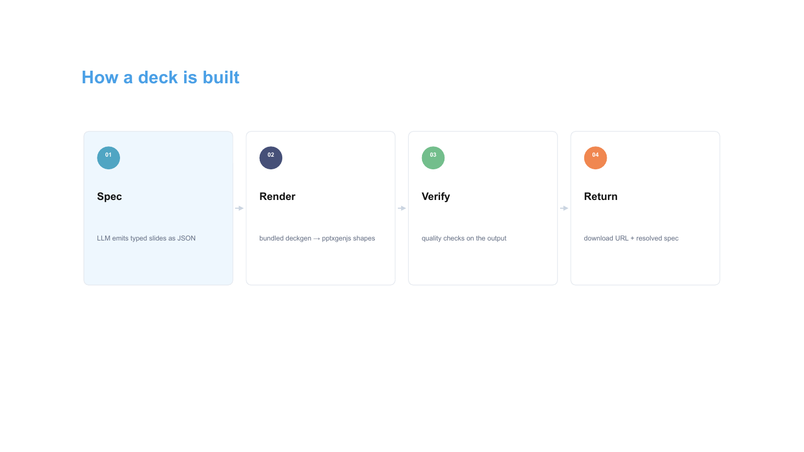
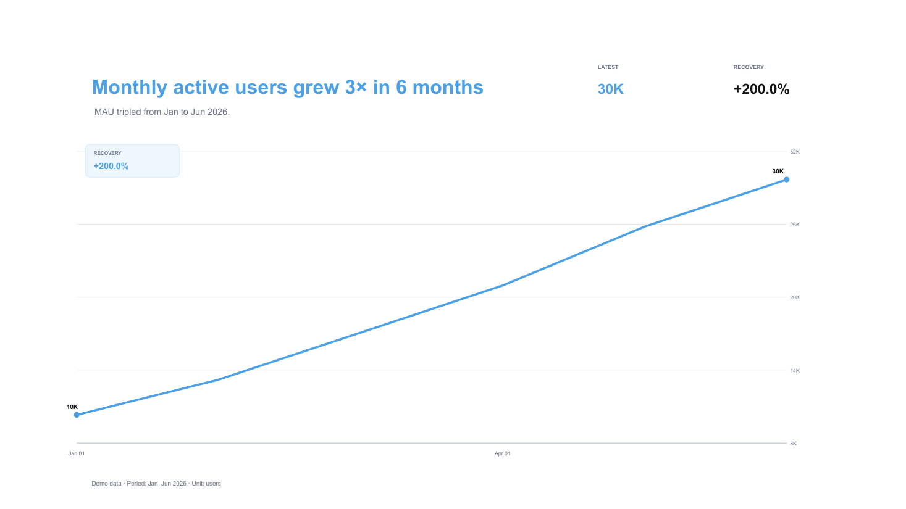
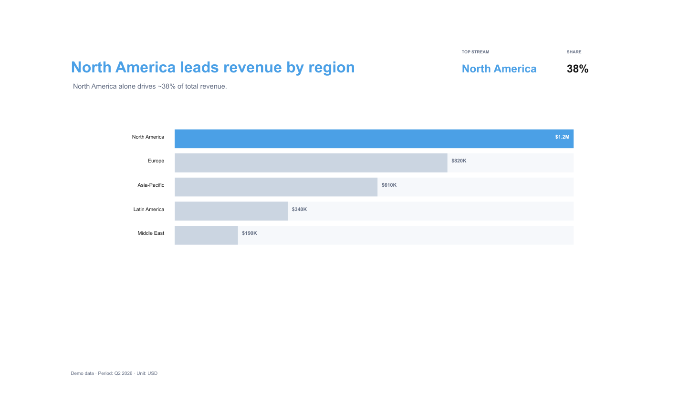
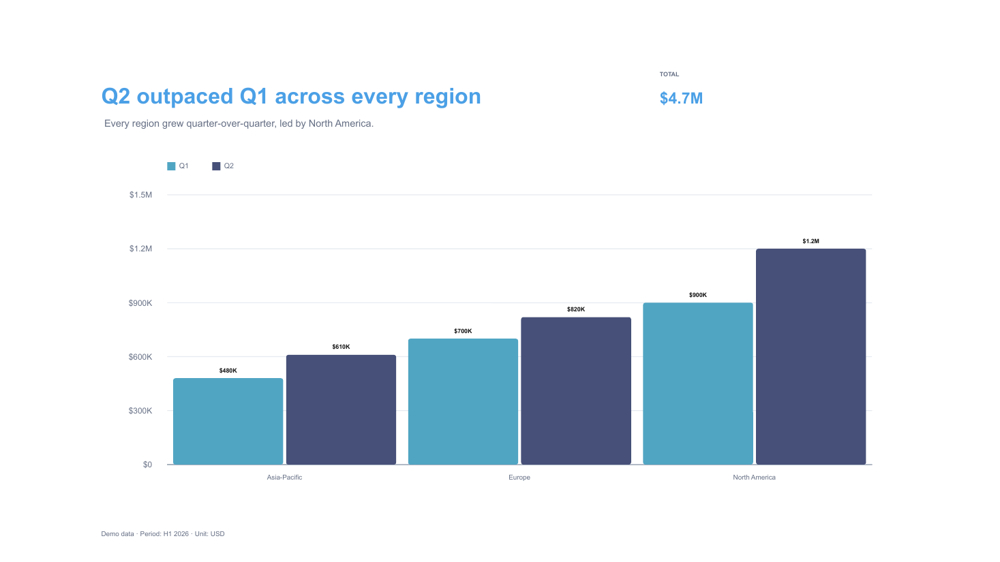
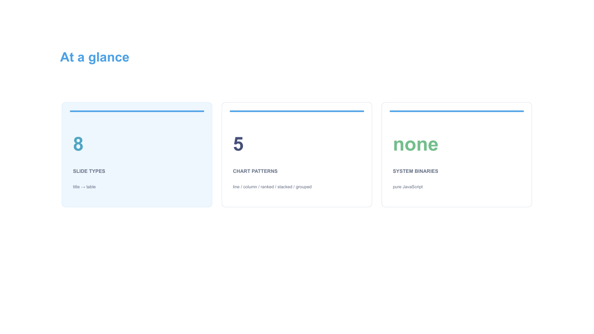
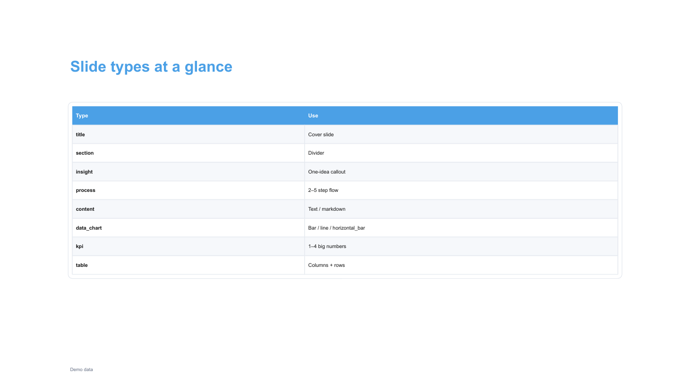
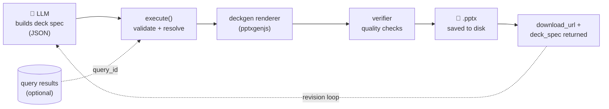
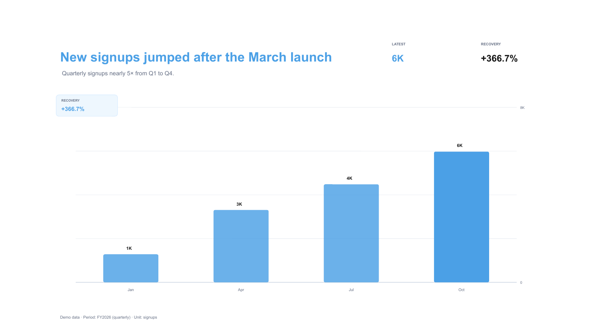
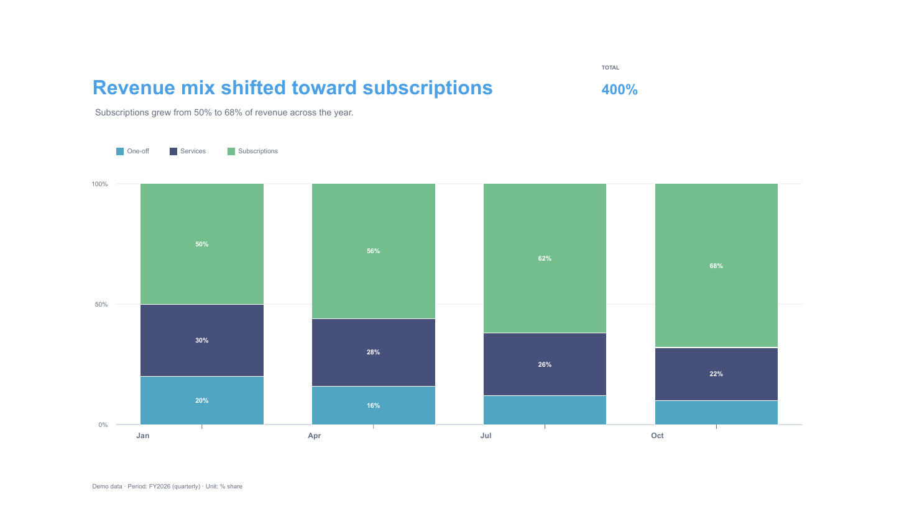

# pptx-agent-tool

Standalone AI agent tool for generating editable PowerPoint presentations.
Framework-agnostic — integrates with any backend (Fastify, Express, Hono, etc.).

The PPTX renderer (`deckgen`) is **bundled** in this package — no external service or
separate setup required. It builds slides from editable PowerPoint shapes (no native
chart objects, no full-slide rasters) using [`pptxgenjs`](https://github.com/gitbrent/PptxGenJS).

## Example output

Real slides from `npm run demo` (all 8 slide types + 5 chart patterns, neutral theme):

| | |
|---|---|
|  |  |
|  |  |
|  |  |

<sub>Regenerate with [`scripts/screenshots.sh`](scripts/screenshots.sh) (requires LibreOffice + poppler — only for rendering previews, not for the library itself).</sub>

## How it works



1. The **LLM** emits a deck spec matching `InputSchema` (a list of typed slides).
2. **`execute()`** validates the spec, resolves any `query_id` references into chart data, and invokes the bundled renderer.
3. **`deckgen`** renders editable PowerPoint shapes (no rasterized slides, no native chart objects), then the **verifier** runs quality checks (units, periods, alt-text, contrast).
4. The saved `.pptx` plus a `download_url` and the fully-resolved `deck_spec` are returned. The spec feeds the **revision loop** — the LLM edits only the changed slides and calls again.

## Install

```bash
npm install
npm run build      # compile the library (src → dist)
npm run demo       # generate a sample deck into ./output using the bundled renderer
```

Requirements: Node.js >= 18. No system binaries required — the renderer and verifier are pure JavaScript.

## Quick start

```ts
import { execute, registerPresentationRoutes, buildModelOutput, TOOL_DESCRIPTION } from 'pptx-agent-tool';

// 1. Register the download route (Fastify example)
await registerPresentationRoutes(app, {
  presentationsDir: './data/presentations',
  getSession: async (headers) => {
    // parse your auth token/cookie and return { userId } or null
    const userId = await myAuth.getUserIdFromHeaders(headers);
    return userId ? { userId } : null;
  },
  verifyAccess: async (chatId, userId) => {
    // return true if this user owns the chat
    return myChatDb.isOwner(chatId, userId);
  },
});

// 2. Wire up the tool in your LLM tool handler
async function handleGeneratePresentationTool(toolInput: unknown, context: { chatId: string }) {
  const result = await execute(toolInput as Input, {
    presentationsDir: './data/presentations',
    downloadUrlBase: '/api/presentations',
    chatId: context.chatId,
    // optional: override the bundled renderer with a custom deckgen binary
    // deckgenBin: process.env.DECKGEN_BIN,
    // optional: pass query results so the LLM can reference previous SQL results by query_id
    queryResults: context.queryResults,
  });

  // 3. Return what the LLM sees as the tool result
  return buildModelOutput(result);
}

// 4. Register the tool with your LLM provider
const tools = [{
  name: 'generate_presentation',
  description: TOOL_DESCRIPTION,
  inputSchema: InputSchema,   // Zod schema — convert to JSON Schema for your provider
  handler: handleGeneratePresentationTool,
}];
```

## Use via MCP

The tool also ships as a [Model Context Protocol](https://modelcontextprotocol.io) server
(built on [`fastmcp`](https://github.com/punkpeye/fastmcp)), so any MCP client (Claude
Desktop, Claude Code, Cursor, …) can generate presentations with no integration code. It
exposes one tool, `generate_presentation`, whose input is the same `InputSchema` (offered
to the client as JSON Schema).

```bash
npm install && npm run build   # builds dist/ (the server)
```

### Local (stdio)

Register it with your MCP client — e.g. in Claude Desktop's `claude_desktop_config.json`:

```json
{
  "mcpServers": {
    "pptx-agent-tool": {
      "command": "node",
      "args": ["/absolute/path/to/pptx-agent-tool/dist/mcp.js"],
      "env": { "PPTX_OUTPUT_DIR": "/absolute/path/for/generated/decks" }
    }
  }
}
```

### Remote (Streamable HTTP)

For a hosted / shared deployment, run the same server over Streamable HTTP (the current
remote transport; it supersedes the legacy standalone SSE transport):

```bash
MCP_TRANSPORT=http MCP_PORT=8080 MCP_HOST=0.0.0.0 node dist/mcp.js
# serves the MCP endpoint at http://<host>:8080/mcp
```

Then point an HTTP-capable MCP client at `http://<host>:8080/mcp`.

### File delivery

There is no HTTP `download_url` in MCP mode, so the tool returns the saved `.pptx` as a
**local file path** plus a `resource_link`. Files are written to `PPTX_OUTPUT_DIR`
(default: a `pptx-agent-tool` folder under the OS temp dir). For a truly remote server,
the file lives on the server host — pair it with the web mode (`registerPresentationRoutes`)
if clients need to download it over HTTP.

The `bin/pptx-agent-mcp` launcher runs the compiled server when present and falls back to
the TypeScript source via `tsx` for local clones.

## Environment

| Variable | Required | Description |
|---|---|---|
| `DECKGEN_BIN` | No | Override the bundled renderer with a path to a custom `deckgen` CLI binary. Defaults to the bundled one. |
| `PPTX_OUTPUT_DIR` | No | (MCP server) Directory for generated `.pptx` files. Defaults to `<tmp>/pptx-agent-tool`. |
| `MCP_TRANSPORT` | No | (MCP server) `http` to serve Streamable HTTP; anything else uses stdio (default). |
| `MCP_PORT` / `PORT` | No | (MCP server, HTTP) Port to listen on. Default `8080`. |
| `MCP_HOST` | No | (MCP server, HTTP) Bind address. Default localhost; set `0.0.0.0` for remote access. |

## Slide types

| Type | Description |
|---|---|
| `title` | Cover slide (title + subtitle) |
| `section` | Section divider |
| `insight` | Large one-idea callout with optional support block |
| `process` | 2-5 connected editable step cards |
| `content` | Text/markdown slide |
| `data_chart` | Chart: bar / line / horizontal_bar with pattern + intent |
| `kpi` | 1-4 big number cards |
| `table` | Data table with columns/rows |

## Slide examples

Each slide is a typed object inside `slides[]`. The renderer turns these into editable shapes.

**`title`** — cover slide
```json
{ "type": "title", "title": "Q1 2026 Business Review", "subtitle": "Revenue, growth, and key metrics" }
```

**`section`** — divider
```json
{ "type": "section", "title": "Financial Performance", "body": "Part 1 of 3" }
```

**`insight`** — large one-idea callout
```json
{ "type": "insight", "title": "The headline", "callout": "Revenue doubled in three months", "body": "Driven mostly by new enterprise accounts." }
```

**`process`** — 2–5 connected step cards
```json
{
  "type": "process",
  "title": "How onboarding works",
  "steps": [
    { "label": "01", "title": "Sign up", "body": "Email + workspace name" },
    { "label": "02", "title": "Connect data", "body": "OAuth or API key" },
    { "label": "03", "title": "Generate", "body": "First deck in seconds" }
  ]
}
```

**`content`** — text / markdown (`**bold**`, `- bullets`)
```json
{ "type": "content", "title": "Summary", "body": "- Strong Q1\n- **Revenue up 110%**\n- Churn flat" }
```

**`data_chart`** — chart with pattern + intent (inline `data` OR `query_id`)
```json
{
  "type": "data_chart",
  "title": "Revenue grew steadily",
  "chart": "bar",
  "pattern": "column_trend",
  "intent": "trend_recovery",
  "valueFormat": "currency",
  "unit": "USD",
  "period": "Jan–Mar 2026",
  "altText": "Monthly revenue rising from $1k to $2k over three months",
  "takeaway": "Revenue doubled across the quarter.",
  "data": [
    { "t": "2026-01", "value": 1000 },
    { "t": "2026-02", "value": 1500 },
    { "t": "2026-03", "value": 2000 }
  ]
}
```

**`kpi`** — 1–4 big number cards
```json
{
  "type": "kpi",
  "title": "At a glance",
  "items": [
    { "label": "Total Revenue", "value": "$2.5M", "subtitle": "+110% QoQ" },
    { "label": "Active Users", "value": "48k", "subtitle": "+12% MoM" }
  ]
}
```

**`table`** — columns + rows
```json
{
  "type": "table",
  "title": "Top markets",
  "columns": ["Country", "Revenue", "Share"],
  "rows": [["US", "$1.2M", "48%"], ["DE", "$0.6M", "24%"], ["UK", "$0.4M", "16%"]],
  "source": "Internal data"
}
```

See [`examples/demo.ts`](examples/demo.ts) for a full runnable deck.

## data_chart patterns

`data_chart` supports five patterns. Set `pattern` and `intent` explicitly — the verifier
warns if the data shape doesn't match the declared pattern.

| Pattern | Chart | Use | Typical intent |
|---|---|---|---|
| `line_trend` | line | Continuous trend over time | `trend_recovery` / `trend_decline` |
| `column_trend` | bar | Discrete period volumes | `trend_recovery` / `variance_watch` |
| `ranked_bar` | horizontal_bar | Category rankings | `rank_leader` / `mix_concentration` |
| `stacked_composition` | bar (multi-series) | Composition over time | `composition_shift` |
| `grouped_bar` | bar (multi-series) | Side-by-side comparison | `period_comparison` |

All five rendered from the demo deck:

| line_trend | column_trend | ranked_bar |
|---|---|---|
|  |  |  |

| stacked_composition | grouped_bar |
|---|---|
|  |  |

## Revision workflow

After every successful generation the tool returns `deck_spec` — the fully resolved spec.
Pass it back to the LLM with: "modify only the relevant slides and call generate_presentation again."

## Roadmap

Directional, not committal — order and scope may change. Contributions and ideas welcome
via [issues](https://github.com/VaitaR/pptx-agent-tool/issues).

**Near-term**
- **MCP server** — expose `execute()` as a [Model Context Protocol](https://modelcontextprotocol.io) tool (`generate_presentation`) so any MCP client (Claude Desktop, Claude Code, Cursor, …) can use it without writing integration code. Over stdio it would return a local file path / MCP resource instead of the HTTP `download_url` — an alternative front-end over the same core, not a replacement for the web mode.
- **Theming API** — pass a custom palette / font / logo to `execute()` instead of the fixed neutral theme.
- **More chart types** — pie / donut, area, and combo charts beyond the current bar / line / horizontal_bar.
- **Image & media slides** — embed images alongside text and charts.
- Fix the stacked-composition KPI total (currently sums shares to a misleading "TOTAL").

**Later**
- **JSON Schema export** — a ready-made schema for LLM providers that don't speak Zod.
- **Speaker notes** — distinct from `altText`.
- **Optional PDF / PNG export helper** — wrap the LibreOffice pipeline used for the README previews.
- **Master / template slides**.

## Non-goals

To keep the scope tight, this project intentionally does **not** aim to be:
- a database connector — chart data arrives inline or via `query_id`, resolved by the host app;
- a hosted service or SaaS;
- a WYSIWYG slide editor.

## Files

```
src/                 Agent-tool library (compiled to dist/)
  schema.ts          Zod input/output schemas
  tool.ts            Core execute() function (resolves the bundled renderer by default)
  storage.ts         savePresentationFile / loadPresentationMeta
  routes.ts          registerPresentationRoutes (Fastify-compatible)
  model-output.ts    buildModelOutput() — string for the LLM
  query-resolver.ts  resolveQueryData() — maps query_id to {t,series,value}[]
  deckgen.ts         runDeckgenCheck / parseDeckgenCheckReport
  index.ts           re-exports everything
renderer/            Bundled deckgen PPTX renderer (run via tsx, not compiled)
  cli.ts             deckgen CLI entrypoint (validate-spec / render / verify / check)
  render-pptx.ts     pptxgenjs deck renderer
  deck-spec.ts       deck spec types + validation
  verify-pptx.ts     rendered-PPTX quality verifier
  chart-patterns.ts  chart pattern / intent inference + warnings
  theme.ts           neutral color/font theme
  layouts.ts         slide layout geometry
bin/deckgen          launcher: node --import tsx/esm renderer/cli.ts
examples/demo.ts     runnable end-to-end example
```
